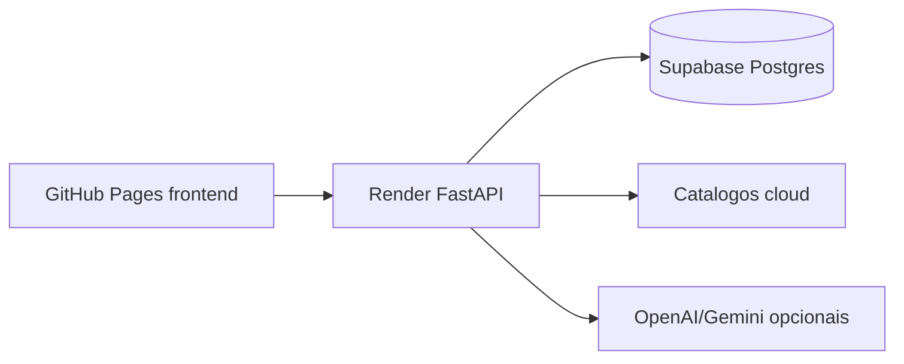

# Arquitetura CloudHelm

Este arquivo resume as regras arquiteturais do projeto. A documentacao operacional detalhada fica em `docs/`.

## Principios

- Separar frontend estatico, backend API e infraestrutura como codigo.
- Manter segredos fora do Git e sempre em variaveis de ambiente.
- Usar banco gerenciado em producao; SQLite e apenas local.
- Priorizar custo baixo para MVP, sem bloquear evolucao futura.
- Documentar rotas e decisoes arquiteturais junto com mudancas relevantes.

## Topologia atual

## Fontes de verdade

- `docs/ARCHITECTURE.md`: arquitetura atual.
- `docs/API_ROUTES.md`: contratos HTTP.
- `docs/SYSTEM_FLOW.md`: fluxos funcionais.
- `docs/DEPLOYMENT_FREE.md`: procedimento de deploy gratuito.

## Regras de implementacao

- Novas rotas entram em `api/app/api_v1/endpoints/` e sao registradas em `api/app/api_v1/router.py`.
- Nao duplicar `/api` em routers; o prefixo global fica em `api/app/main.py`.
- Novas configuracoes devem passar por `api/app/core/config.py` e `.env.example`.
- Artefatos gerados, bancos locais e arquivos `.env` nao devem ser versionados.
