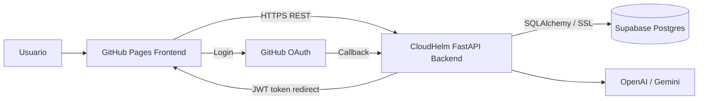

# CloudHelm

Official repository for the **CloudHelm** product.

## Structure

- `.agent/`: internal agents, skills, and orchestration workflows.
- `api/`: backend API (FastAPI), orchestration logic, auth/backoffice.
- `infrastructure/`: Infrastructure as Code (Terraform, Ansible).
- `docs/`: System documentation and architecture diagrams.
- `frontend/`: static frontend for GitHub Pages.

## Deployment Model

- Frontend: GitHub Pages (`frontend/`)
- Backend API: public FastAPI runtime (Render/Railway/Fly/etc.)
- Database: Supabase Postgres

## Architecture Diagram

## Setup Guides

- [`api/README.md`](api/README.md)
- [`api/docs/RUN_ANYWHERE.md`](api/docs/RUN_ANYWHERE.md)
- [`docs/TESTING.md`](docs/TESTING.md)
