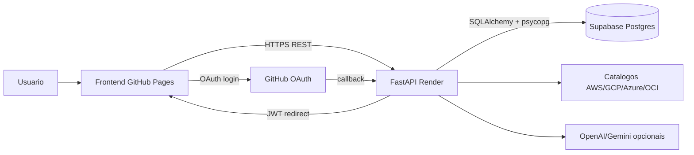

# Arquitetura da Aplicacao

## Visao geral

CloudHelm usa uma arquitetura simples de MVP SaaS: frontend estatico no GitHub Pages, backend FastAPI em container Docker no Render e banco gerenciado Supabase Postgres.

## Componentes

### Frontend

- Local: `frontend/`.
- Runtime: arquivos estaticos servidos pelo GitHub Pages.
- Configuracao: `frontend/config.js` define `API_BASE_URL`, `FRONTEND_HOME_URL` e `FRONTEND_BACKOFFICE_URL`.
- Responsabilidade: UI, chamadas HTTP, autenticacao client-side por token JWT e telas de backoffice.

### Backend

- Local: `api/app/`.
- Runtime: FastAPI via Docker no Render.
- Entrada: `api/app/main.py`.
- Rotas: `api/app/api_v1/endpoints/` agregadas por `api/app/api_v1/router.py` sob prefixo global `/api`.
- Responsabilidade: autenticacao, autorizacao, catalogo cloud, estimativa de custos, orquestracao de demandas e backoffice.

### Banco de dados

- Producao: Supabase Postgres via `DATABASE_URL`.
- Desenvolvimento: SQLite apenas local, sem versionamento.
- ORM: SQLAlchemy.
- Inicializacao: `Base.metadata.create_all()` no startup e compatibilidade incremental para colunas de usuarios.

### Catalogo e custos cloud

- Catalogo: `CloudMasterEngine` sincroniza dados de AWS, GCP, Azure e OCI quando disponiveis.
- Fallback: provedores sem credencial/API disponivel usam dados padrao para manter a aplicacao funcional.
- Estimativa: `/api/pricing/estimate` calcula custo mensal por provedor a partir do catalogo persistido e premissas do payload.

### Autenticacao e acesso

- GitHub OAuth redireciona para `/api/auth/github/callback`.
- Backend emite JWT e redireciona de volta para o frontend.
- Usuarios podem ficar pendentes ate aprovacao no backoffice.
- `GITHUB_ADMIN_LOGINS` define logins GitHub com perfil administrativo inicial.

## Decisoes arquiteturais atuais

- Separar frontend e backend reduz custo e complexidade operacional.
- Render Docker suporta o backend Python sem adaptar para serverless.
- Supabase evita banco local em producao e fornece Postgres gerenciado no free tier.
- Rotas usam prefixo unico `/api` no `main.py`; endpoints nao devem repetir `/api` internamente.
- Segredos ficam em variaveis de ambiente da plataforma, nunca no repositorio.

## Riscos tecnicos conhecidos

- Render Free pode hibernar e causar cold start.
- Ainda nao ha Alembic; migracoes estruturais estao parcialmente no startup.
- Catalogos reais dependem de disponibilidade das APIs externas e credenciais.
- Testes automatizados ainda precisam cobrir fluxos de autenticacao/backoffice com mais profundidade.
