# BPMN — análise e recomendação de infraestrutura

O processo abaixo corresponde ao arquivo BPMN 2.0 [cloudhelm-demand.bpmn](cloudhelm-demand.bpmn). Ele cobre o caminho principal e as decisões de autenticação, catálogo e LLM.

```mermaid
flowchart LR
    Start((Início)) --> Auth{JWT válido?}
    Auth -- Não --> Login[Autenticar via GitHub OAuth]
    Login --> Auth
    Auth -- Sim --> Capture[Registrar demanda]
    Capture --> Catalog[Carregar catálogo cloud]
    Catalog --> CatalogOK{Catálogo disponível?}
    CatalogOK -- Não --> FallbackPrice[Usar preços baseline]
    CatalogOK -- Sim --> Estimate[Estimar custos]
    FallbackPrice --> Estimate
    Estimate --> Rank[Classificar provedores]
    Rank --> LLM{LLM configurado?}
    LLM -- Sim --> Brief[Gerar briefing arquitetural]
    LLM -- Não --> Deterministic[Gerar briefing determinístico]
    Brief --> Terraform[Montar Terraform sugerido]
    Deterministic --> Terraform
    Terraform --> Persist[Registrar resultado/auditoria]
    Persist --> Present[Apresentar ranking, custos e arquitetura]
    Present --> End((Fim))
```

Participantes BPMN:

- **Usuário**: inicia a demanda e consome a recomendação.
- **Frontend**: coleta dados e apresenta o resultado.
- **API CloudHelm**: coordena o processo.
- **Serviços externos**: GitHub OAuth, catálogos cloud e LLM opcional.
- **Banco**: persiste demanda, catálogo, configurações e auditoria.
