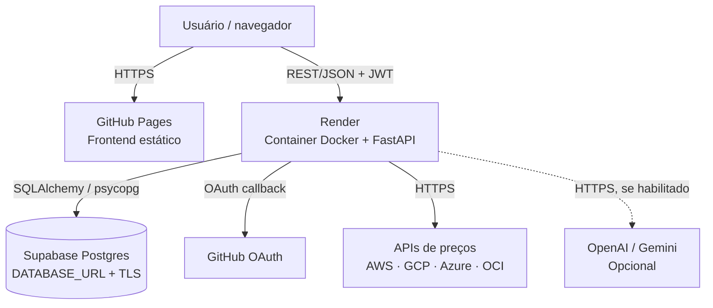
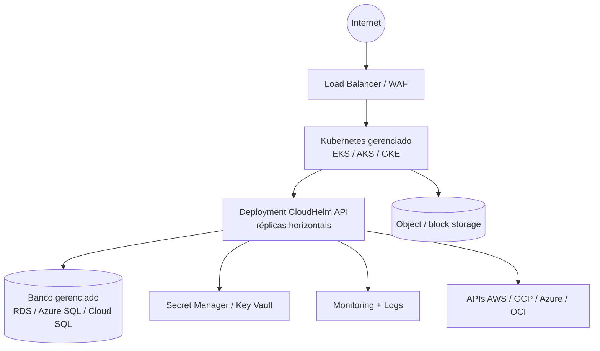

# Arquitetura de infraestrutura

## Estado atual — produção

Runtime e responsabilidades:

- GitHub Actions publica `frontend/` no GitHub Pages.
- Render executa `api/Dockerfile`, faz deploy automático de `main` e verifica `/health`.
- Supabase mantém o Postgres gerenciado; SQLite é somente local.
- Segredos e URLs são variáveis de ambiente do Render.

## Estado-alvo — provisionamento em cloud

Os playbooks em `infrastructure/ansible/` e módulos Terraform descrevem uma topologia alternativa para execução em AWS, Azure ou GCP. Ela não substitui o deployment atual sem uma migração explícita.

Requisitos de evolução: ingress/TLS, secret manager, backup e restore testados, observabilidade, autoscaling, migrations controladas e política de rede. A extração para workers de catálogo/LLM deve ocorrer somente quando houver necessidade de escala ou isolamento.
