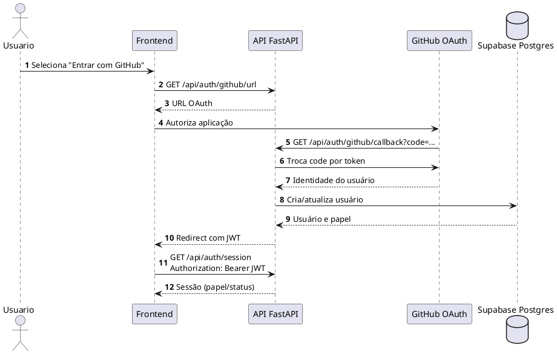
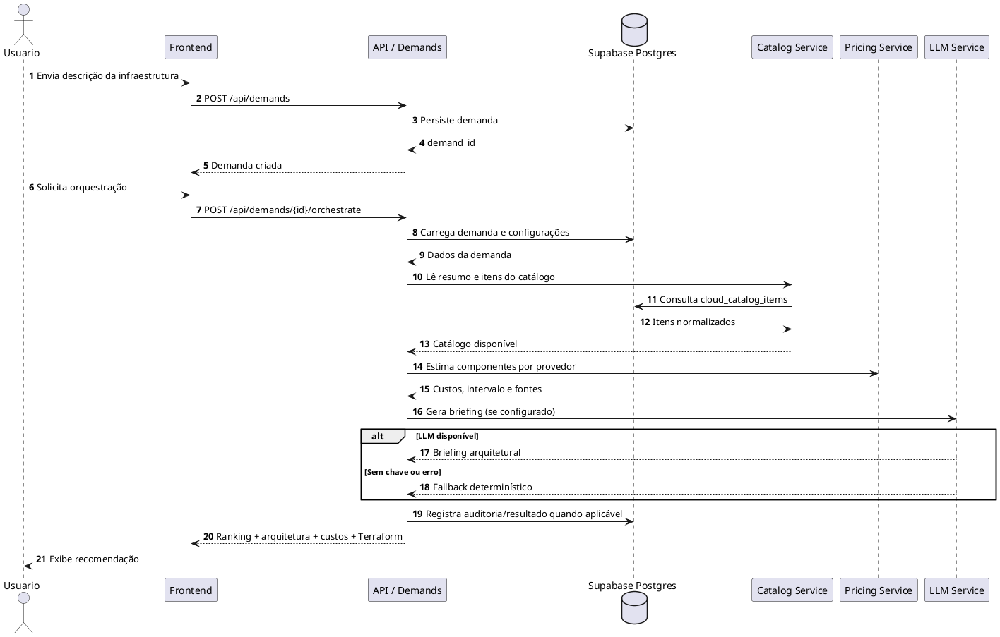

# Diagramas de sequência — CloudHelm

## Login GitHub OAuth

## Orquestração de demanda

## Regras de falha relevantes

- Falha de um catálogo não interrompe a estimativa: o componente usa baseline determinístico.
- Falha ou ausência de credencial de LLM não interrompe a orquestração.
- Indisponibilidade do Postgres impede operações autenticadas e persistentes; o healthcheck deve sinalizar a degradação.
